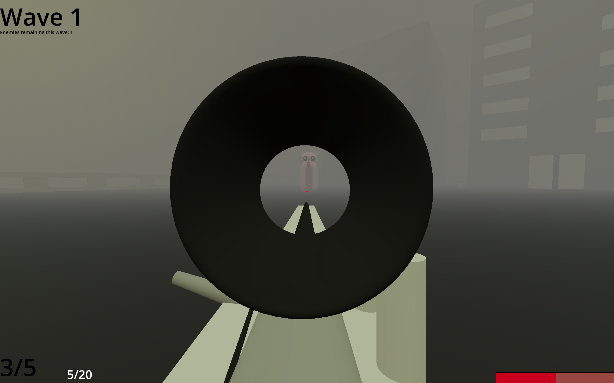
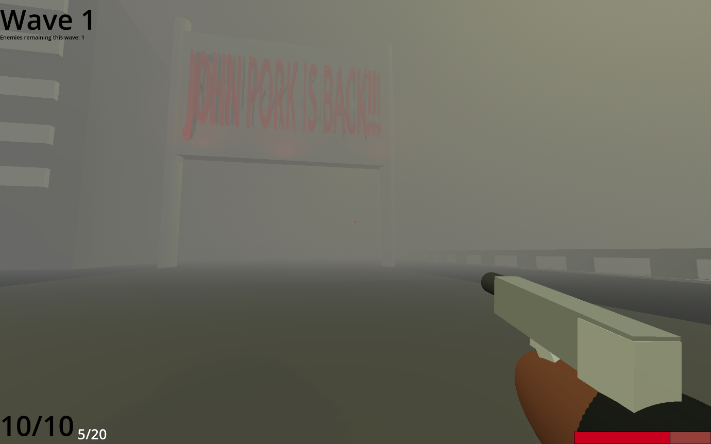
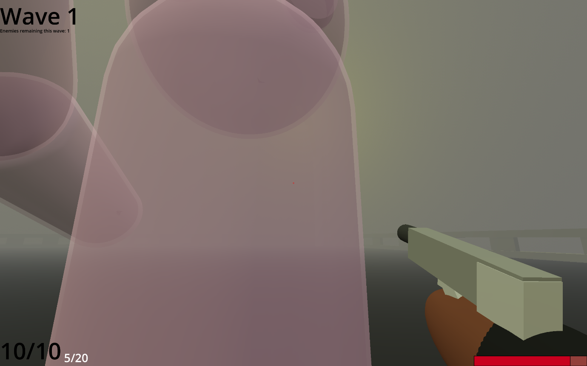
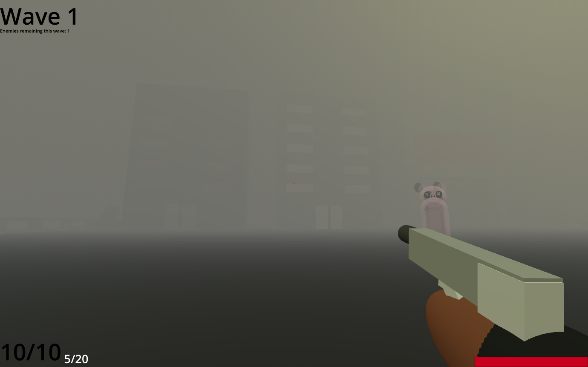

Dylan Flink Shooter Assignment C24486954 Game Design

The Trials and Tribulations of Tim Cheese

Video link <https://youtu.be/KURA5d1ajxo>

Description: My Project is a wave-based shooter game based on the famous John Pork Tiktok story series. I used some of the character’s present in the series, John Pork and Tim Cheese and based my game around the series’ lore.

The story of my game is that Tim Cheese, the protagonist, is having a nightmare, haunted by apparitions of John Pork. John used to be a dear friend of Tim, however bad blood brewed between them as John started becoming distant from his childhood friends and ignorant to them. Tim Cheese got rid of him for good a couple of nights ago, and he has to lay low till the heat dies down. During this time, he can barely sleep, haunted by the ghosts in his dreams. Here he has to fend off the waves of John pork and try and have a peaceful night’s sleep.

Before starting my project, my partner, Mylo and I had been discussing wanting to do some sort of Godot project together. He had used Godot previously but was rusty and I thought it would be a really fun thing to do together. We both thought that this project was a perfect starting point for working together and it ended up being really fun and I’m very proud of what we both accomplished with the game. Mylo helped me with some of the coding aspects of the game I wasn’t sure on how to do and walked me through how to do bits I was stuck on or through code he had made for the project and I learned a lot from this. He also was more familiar with GitHub and helped me with technical issues there and merge conflicts. Overall I think I came out of this project having a way better understanding of Godot and gdscript than I did before it and I have Mylo’s help to thank for a lot of that.

Mechanics: The character has basic wasd movement and a jump. The jump can be held to bunny hop. There also is two weapons, a pistol and a sniper. They both have magazines however the pistol has infinite reloads and the sniper rifle is finite. This is because the sniper does more damage and has some “unique” properties. Being a dream that isn’t very grounded in reality, the player can launch themselves all over the place with blowback from the sniper, leading to fun movement and extra skills to master. As mentioned before however, the sniper is finite, requiring ammo pickups to replenish. If you run out of sniper ammo your movement is way more limited leaving you more exposed to the waves of ghostly pigs. This encourages smart swapping of the two weapons to keep ammo stock plentiful. There are no health pickups, which encourages players to play smart from the beginning of the game as any health you lose is lost forever.

Buttons:

WASD to move

SPACE to jump

1 to switch to pistol

2 to switch to sniper

SCROLL WHEEL to cycle weapons

LEFT CLICK to fire

RIGHT CLICK to zoom (sniper)

R to reload

How it works:

There is a start screen, with a button that loads into the main scene, before pressing that however, there are difficulty buttons at the bottom of the screen that increase and decrease the difficulty using a difficulty array and index variable.

Once in the main scene, a wave starts and with each wave that starts the wave count is multiplied by the difficulty value set through the index. Each pig spawns randomly on a set path3d and follow the player. However, if the player goes past a certain y value by using the sniper, the pigs scatter to random locations on the spawn path to make shooting them less easy midair and remove some of the cheese you could do with the sniper without this feature.

Each pig has a fifteen percent chance of dropping the ammo crates needed for the sniper

If you fly out of the area you will die past a certain -y coordinate, this punishes people playing too carelessly with the sniper. Once you eventually die you get a death screen that returns you to the main menu after a certain amount of time.

Inspirations: My main inspirations were Vampire survivors and black ops zombies for the horde-based gameplay.

List Of Classes And Assets In The Project:

Class/Assets Source

Pistol.res Made by me

Ammo.gd Made by me

Arms.tscn Made by me

John_Pork.tscn Made by me

John_Pork_death_particle.tscn Made by me

Muzzle_flash.tscn Made by me with help of tutorial

Pistol.tscn Made by me

Sniper_rifle.tscn Made by me

Arms.tres Made by me

Building1.tres Made by me

Door 2.tres Made by me

flash.tres Made by me with help of tutorial

gun metal.tres Made by me

johnporkskin.tres Made by me with small help of tutorial

mag_pistol_skin.tres Made by me

NEONSIGN.tres Made by me

new_standard_material.tres Made by me

road.tres Made by me

shirt.tres Made by me

smoke.tres Made by me

windows.tres Made by me

death_screen.tscn Made by me and Mylo

hud.tscn Made by me and Mylo

start_screen.tscn Made by me and Mylo

gun_cam.tscn Made mostly by me and partly by Mylo

main.tscn Made by me and Mylo

map.tscn Made mostly by me and partly by Mylo

arms.gd Made by me and Mylo

character_body_3d.gd Made by me and Mylo

death_screen.gd Made by Mylo and edited by me

gun_cam.gd Made mostly by me and partly by Mylo

JohnPork.gd Made by me and Mylo

main.gd Made mostly by Mylo and partly by me

pistol.gd Made by me and Mylo

player_hit_sounds.gd Made by Mylo

sniper_rifle.gd Made by me and Mylo

start_screen.gd Made by me and Mylo

Ghostlyshader.gdshader Made by me with help from tutorial

sky.gdshader Made by me and Mylo with help from tutorial

spooky_outline.gdshader Made by me with help from tutorial

All sound effects Found on Freesound.org

Start menu pictures Taken from Tiktok videos made with ai

default_bus_layout.tres Made by me

References:

-   S: [Church bells ringing from outside with voice singing coming from loudspeaker recorded in Baby Jesus lullaby celebration](https://freesound.org/people/felix.blume/sounds/684938/) by felix.blume \| License: [Creative Commons 0](http://creativecommons.org/publicdomain/zero/1.0/)

**Downloaded on May 7th, 2025**

-   [S:](http://creativecommons.org/publicdomain/zero/1.0/) [Mouse Squeaks.wav](https://freesound.org/people/shyguy014/sounds/463789/) by [shyguy014](https://freesound.org/people/shyguy014/) \| License: [Creative Commons 0](http://creativecommons.org/publicdomain/zero/1.0/)
-   [S:](http://creativecommons.org/publicdomain/zero/1.0/) [awp reload sound.mp3](https://freesound.org/people/GFL7/sounds/276956/) by [GFL7](https://freesound.org/people/GFL7/) \| License: [Creative Commons 0](http://creativecommons.org/publicdomain/zero/1.0/)
-   [S:](http://creativecommons.org/publicdomain/zero/1.0/) [Metal Flick Spring](https://freesound.org/people/WasabiWielder/sounds/323372/) by WasabiWielder \| License: [Creative Commons 0](http://creativecommons.org/publicdomain/zero/1.0/)
-   [S:](http://creativecommons.org/publicdomain/zero/1.0/) [gunfiddle.wav](https://freesound.org/people/j1987/sounds/107795/) by [j1987](https://freesound.org/people/j1987/) \| License: [Creative Commons 0](http://creativecommons.org/publicdomain/zero/1.0/)
-   [S:](http://creativecommons.org/publicdomain/zero/1.0/) [Single Gunshot 2.wav](https://freesound.org/people/morganpurkis/sounds/370304/) by morganpurkis \| License: [Creative Commons 0](http://creativecommons.org/publicdomain/zero/1.0/)

**Downloaded on April 4th, 2025**

-   [S:](http://creativecommons.org/publicdomain/zero/1.0/) [Empty Gun Shot](https://freesound.org/people/KlawyKogut/sounds/154934/) by KlawyKogut \| License: [Creative Commons 0](http://creativecommons.org/publicdomain/zero/1.0/)
-   [S:](http://creativecommons.org/publicdomain/zero/1.0/) [Reload.mp3](https://freesound.org/people/LAGtheNoggin/sounds/15545/) by LAGtheNoggin \| License: [Sampling+](http://creativecommons.org/licenses/sampling+/1.0/)
-   [S:](http://creativecommons.org/licenses/sampling+/1.0/) [1911 Reload](https://freesound.org/people/nioczkus/sounds/396331/) by nioczkus \| License: [Creative Commons 0](http://creativecommons.org/publicdomain/zero/1.0/)

**Downloaded on March 27th, 2025**

-   [S:](http://creativecommons.org/publicdomain/zero/1.0/) [Pistol - perfect shot with silencer](https://freesound.org/people/TILIADESIGN/sounds/489069/) by [TILIADESIGN](https://freesound.org/people/TILIADESIGN/) \| License: [Creative Commons 0](http://creativecommons.org/publicdomain/zero/1.0/)
-   [S:](http://creativecommons.org/publicdomain/zero/1.0/) [Pistol Cock.wav](https://freesound.org/people/nebulasnails/sounds/405538/) by nebulasnails \| License: [Creative Commons 0](http://creativecommons.org/publicdomain/zero/1.0/)
-   <https://youtu.be/a3GjUyBDwe4?si=LZP6TgmpUOgJPs5x>
-   <https://youtu.be/6Bqwk7AiWiU?si=LxV_IXg6R5ENovj7>
-   <https://youtu.be/WoWlaB95Rzs?si=VpigohHG8ouI_t9m>
-   Some bits of code may have been fixed or made with the help of ai towards the start of the project.

What I am Most Proud of:

Dylan: I am really proud of my animations, sound design and modelling of the weapons, characters and environment. I love the vibe in the game and love how the animations look. I am also really proud of the project overall and how much I have accomplished over the time spent working on it.

Mylo: The physics (sniper physics in general)

What I learned:

Dylan: I learned how to use Godot much more effectively and I have a better understanding of what it is capable of. This is my first time working on a 3D project on Godot and I think it gave me a great first impression of what can be done with it. I also learned to become much more capable of gdscript and I find that I can read and understand code much easier, as well as write it myself and use my intuition to figure things out.

Mylo: Source-like physics e.g csgo or tf2
